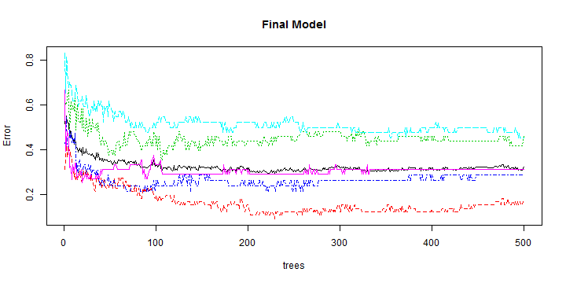
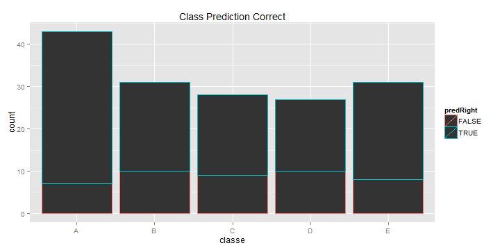
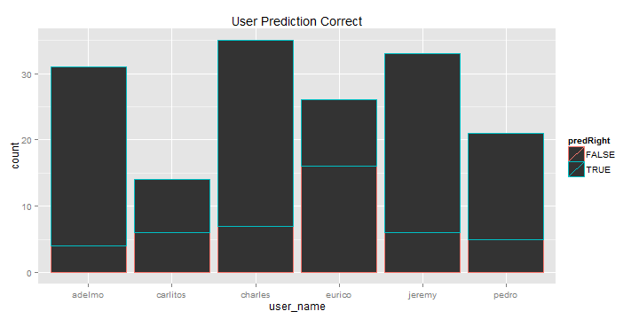

Practical Machine Learning - Project
========================================================
 -Katherine Roberts

## Project Details - Report

Using the data and code described here, I trained a model on 60% of the training dataset and then used the model to predict on the remaining 40%. Once adjusted appropriately, the final model was then used to predict the outcome of a test dataset containing 20 values.

Variables (columns) containing missing values were removed prior to training the model. The data set used contained complete cases. 406 observations and 50 variables remained in the training set. The data were then partitioned into a 60/40 split for training and test sets. Using only the 60% training set, all varaibles were assessed for zero variability. All indicated some amount of variability that could make a useful predictor. Random forest method was used to train the set to model our outcome, class. Class ('classe') is a categorical variable containing values "A", "B", "C", "D", "E". Details on variables are provided in the background section.

The results indicate that the expected/average accuracy for a properly cross-validated experiment should be 0.65. The reported OOB estimate of error rate is 30.89%.The error rates per class are here: A) 0.1818182, B) 0.5208333, C) 0.2142857, D) 0.3333333, and E) 0.3333333.

This prediction model was then used on the testing (validation) set. Accuracy was 75%.


## Background
#### Project
Using devices such as Jawbone Up, Nike FuelBand, and Fitbit it is now possible to collect a large amount of data about personal activity relatively inexpensively. These type of devices are part of the quantified self movement - a group of enthusiasts who take measurements about themselves regularly to improve their health, to find patterns in their behavior, or because they are tech geeks (yay!). One thing that people regularly do is quantify how much of a particular activity they do, but they rarely quantify how well they do it. In this project, our goal was to use data from accelerometers on the belt, forearm, arm, and dumbell of 6 participants. They were asked to perform barbell lifts correctly and incorrectly in 5 different ways. More information is available from the website here: http://groupware.les.inf.puc-rio.br/har (see the section on the Weight Lifting Exercise Dataset). 

#### Specifics from the source paper
Participants were asked to perform one set of 10 repetitions of the Unilateral Dumbbell Biceps Curl in five different fashions: exactly according to the specification (Class A), throwing the elbows to the front (Class B), lifting the dumbbell only halfway (Class C), lowering the dumbbell only halfway (Class D) and throwing the hips to the front (Class E). Class A corresponds to the specified execution of the exercise, while the other 4 classes correspond to common mistakes.[1]

The exercises were performed by six male participants aged between 20-28 years, with little weight lifting experience.[1]

For feature extraction we used a sliding window approach with different lengths from 0.5 second to 2.5 seconds, with 0.5 second overlap. In each step of the sliding window approach we calculated features on the Euler angles (roll, pitch and yaw), as well as the raw accelerometer, gyroscope and magnetometer readings.[1]

### Source Reference:

1.  Velloso E, Bulling A, Gellersen H, Ugulino W, Fuks H. Qualitative Activity Recognition of Weight Lifting Exercises. In: Proceedings of the 4th Augmented Human International Conference. AH '13. New York, NY, USA: ACM; 2013:116-123. doi:10.1145/2459236.2459256.


The technology used to generate the dataset. R Project version and CPU and OS:

```
## [1] "R version 3.1.0 (2014-04-10)"
```

```
## [1] "x86_64, mingw32"
```


Libraries used for this data:

```r
library(ggplot2)
library(caret)
```


### Load Data
Set appropriate directory paths - set session working dir to your prog (or appropriate) directory


Load the csv 'pml-training' data we will use to build our prediction model. Subset data into useful model set of outcome, user_name, and raw values. Eliminate NA columns for complete case data.

```r
# subset data into useful model set of outcome, user_name, and raw values
newdata <- csvtraining[which(csvtraining$new_window == "yes"), ]
na.strings = c("", "NA", "#DIV/0!")
newdata[newdata == "#DIV/0!"] <- NA
newdatanoNA <- newdata[, !sapply(newdata, function(x) any(is.na(x)))]
newdatacomp = newdatanoNA[complete.cases(newdatanoNA), ]

subbed <- subset(newdatacomp, select = c(2, 8:10, 28:39, 51:59, 69:71, 89:100, 
    118:127))
```


### Create Partition for Training and Test Sets
Set seed and create a data partition using the caret package.

```r
set.seed(16165)
library(ggplot2)
```

```
## Warning: package 'ggplot2' was built under R version 3.1.2
```

```r
library(caret)
```

```
## Warning: package 'caret' was built under R version 3.1.2
```

```
## Loading required package: lattice
```

```r
# create partition for training and testing (the 'test' data we will apply
# the predictions to will be our 'validation' set)
inTrain <- createDataPartition(y = subbed$classe, p = 0.6, list = FALSE)
# 60% to train, 40% to test.
training <- subbed[inTrain, ]
testing <- subbed[-inTrain, ]
dim(training)
```

```
## [1] 246  50
```

```r
dim(testing)
```

```
## [1] 160  50
```


### Assess Data Variability
Use the nearZeroVar to identify variables with very little variabliity and therefore will likely not make good predictors.

```r
library(caret)
nsv <- nearZeroVar(training, saveMetrics = TRUE)
nsv
```

```
##                   freqRatio percentUnique zeroVar   nzv
## user_name             1.130         2.439   FALSE FALSE
## roll_belt             1.667        51.626   FALSE FALSE
## pitch_belt            1.000        81.707   FALSE FALSE
## yaw_belt              1.143        64.634   FALSE FALSE
## gyros_belt_x          1.375        20.732   FALSE FALSE
## gyros_belt_y          1.140         9.756   FALSE FALSE
## gyros_belt_z          1.100        19.919   FALSE FALSE
## accel_belt_x          1.214        27.236   FALSE FALSE
## accel_belt_y          1.000        23.171   FALSE FALSE
## accel_belt_z          1.231        35.366   FALSE FALSE
## magnet_belt_x         1.143        47.154   FALSE FALSE
## magnet_belt_y         1.200        36.992   FALSE FALSE
## magnet_belt_z         1.000        46.748   FALSE FALSE
## roll_arm             14.667        76.423   FALSE FALSE
## pitch_arm            14.667        77.642   FALSE FALSE
## yaw_arm              14.667        77.642   FALSE FALSE
## gyros_arm_x           1.000        72.358   FALSE FALSE
## gyros_arm_y           1.667        58.130   FALSE FALSE
## gyros_arm_z           1.500        45.122   FALSE FALSE
## accel_arm_x           1.000        78.455   FALSE FALSE
## accel_arm_y           1.250        70.325   FALSE FALSE
## accel_arm_z           1.500        73.577   FALSE FALSE
## magnet_arm_x          1.000        89.431   FALSE FALSE
## magnet_arm_y          1.000        86.179   FALSE FALSE
## magnet_arm_z          1.333        81.301   FALSE FALSE
## roll_dumbbell         1.333        91.870   FALSE FALSE
## pitch_dumbbell        1.000        85.366   FALSE FALSE
## yaw_dumbbell          1.000        93.089   FALSE FALSE
## gyros_dumbbell_x      1.000        35.772   FALSE FALSE
## gyros_dumbbell_y      1.375        39.024   FALSE FALSE
## gyros_dumbbell_z      1.100        30.894   FALSE FALSE
## accel_dumbbell_x      1.333        48.374   FALSE FALSE
## accel_dumbbell_y      1.000        67.886   FALSE FALSE
## accel_dumbbell_z      1.250        64.228   FALSE FALSE
## magnet_dumbbell_x     1.333        74.797   FALSE FALSE
## magnet_dumbbell_y     1.000        75.203   FALSE FALSE
## magnet_dumbbell_z     1.250        70.732   FALSE FALSE
## roll_forearm          8.667        56.911   FALSE FALSE
## pitch_forearm        17.333        71.545   FALSE FALSE
## yaw_forearm          13.000        63.821   FALSE FALSE
## gyros_forearm_x       1.000        47.154   FALSE FALSE
## gyros_forearm_y       1.200        76.016   FALSE FALSE
## gyros_forearm_z       1.000        48.374   FALSE FALSE
## accel_forearm_x       1.000        81.301   FALSE FALSE
## accel_forearm_y       1.000        81.707   FALSE FALSE
## accel_forearm_z       1.250        67.886   FALSE FALSE
## magnet_forearm_x      1.333        86.992   FALSE FALSE
## magnet_forearm_y      1.333        86.585   FALSE FALSE
## magnet_forearm_z      1.000        88.211   FALSE FALSE
## classe                1.375         2.033   FALSE FALSE
```

Note: all varaibles contain some amount of variability that could make a useful predictor


### Train Model on 60% Training Set
Using the train command from the caret package, we are trying to predit "classe" from the other variables. We will use the random forest method:

```r
modelFit <- train(classe ~ ., data = training, method = "rf", prox = TRUE)
```

```
## Loading required package: randomForest
```

```
## Warning: package 'randomForest' was built under R version 3.1.2
```

```
## randomForest 4.6-10
## Type rfNews() to see new features/changes/bug fixes.
```

```r
# look at the model we fit
print(modelFit)
```

```
## Random Forest 
## 
## 246 samples
##  49 predictor
##   5 classes: 'A', 'B', 'C', 'D', 'E' 
## 
## No pre-processing
## Resampling: Bootstrapped (25 reps) 
## 
## Summary of sample sizes: 246, 246, 246, 246, 246, 246, ... 
## 
## Resampling results across tuning parameters:
## 
##   mtry  Accuracy  Kappa   Accuracy SD  Kappa SD
##    2    0.5819    0.4719  0.05504      0.06854 
##   27    0.5970    0.4914  0.04999      0.06411 
##   53    0.5839    0.4751  0.05578      0.07092 
## 
## Accuracy was used to select the optimal model using  the largest value.
## The final value used for the model was mtry = 27.
```

```r
modelFit$finalModel
```

```
## 
## Call:
##  randomForest(x = x, y = y, mtry = param$mtry, proximity = TRUE) 
##                Type of random forest: classification
##                      Number of trees: 500
## No. of variables tried at each split: 27
## 
##         OOB estimate of  error rate: 32.11%
## Confusion matrix:
##    A  B  C  D  E class.error
## A 55  1  5  5  0      0.1667
## B  4 26  8  8  2      0.4583
## C  5  1 30  5  1      0.2857
## D  7  4  4 23  4      0.4524
## E  4  4  4  3 33      0.3125
```


### Predict Class Outcome using Final Model on 40% Training Set
First, on the training test set (not our validation set)

```r
predictions <- predict(modelFit, newdata = testing)  #gives predictions that correspond to the responses
```


compare predictions to our outcomes

```r
library(ggplot2)
library(caret)
confusionMatrix(predictions, testing$classe)
```

```
## Confusion Matrix and Statistics
## 
##           Reference
## Prediction  A  B  C  D  E
##          A 36  6  7  2  3
##          B  5 21  2  2  2
##          C  1  2 19  2  2
##          D  1  2  0 17  1
##          E  0  0  0  4 23
## 
## Overall Statistics
##                                         
##                Accuracy : 0.725         
##                  95% CI : (0.649, 0.793)
##     No Information Rate : 0.269         
##     P-Value [Acc > NIR] : <2e-16        
##                                         
##                   Kappa : 0.651         
##  Mcnemar's Test P-Value : 0.108         
## 
## Statistics by Class:
## 
##                      Class: A Class: B Class: C Class: D Class: E
## Sensitivity             0.837    0.677    0.679    0.630    0.742
## Specificity             0.846    0.915    0.947    0.970    0.969
## Pos Pred Value          0.667    0.656    0.731    0.810    0.852
## Neg Pred Value          0.934    0.922    0.933    0.928    0.940
## Prevalence              0.269    0.194    0.175    0.169    0.194
## Detection Rate          0.225    0.131    0.119    0.106    0.144
## Detection Prevalence    0.338    0.200    0.163    0.131    0.169
## Balanced Accuracy       0.842    0.796    0.813    0.800    0.855
```


Fit our final model to a plot showing the error by random forest trees

```r
finMod <- modelFit$finalModel
plot(finMod, main = "Final Model")
```

 


Create table to see how many predictions we missed

```r
testing$predRight <- predictions == testing$classe  #set a variable to see if we got the prediction right
table(predictions, testing$classe)  #see that we missed several
```

```
##            
## predictions  A  B  C  D  E
##           A 36  6  7  2  3
##           B  5 21  2  2  2
##           C  1  2 19  2  2
##           D  1  2  0 17  1
##           E  0  0  0  4 23
```


Plot to see which predictions we missed by Class and which predictions we missed by user name.

```r
library(ggplot2)
qplot(classe, colour = predRight, data = testing, main = "Class Prediction Correct")
```

 

```r
# the points that were misclassified were mostly in classe e
qplot(user_name, colour = predRight, data = testing, main = "User Prediction Correct")
```

 

Missed classifying in all classes and all users. Mostly for Eurico..


## Discussion and Notes
******************************
My knowledge is limited in this area. Better methods and approaches to the training set are available. This document contains the results of a simplistic approach simply subsetting the data and applying the random forest method. Better accuracy, I'm sure, can be acheived using pre-processing and/or other methods suitable for this data.

